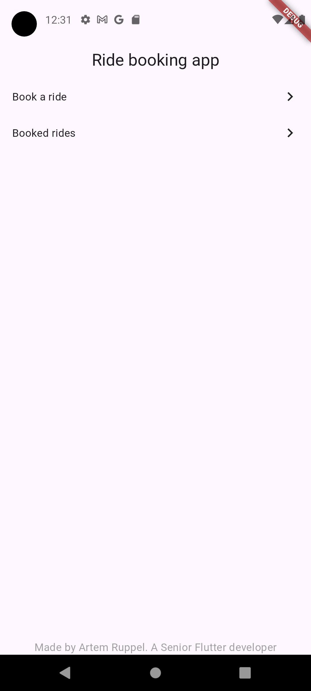
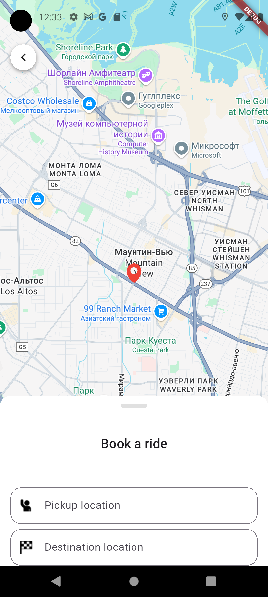
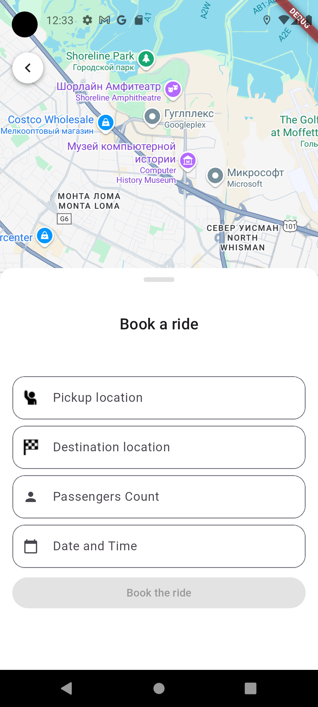
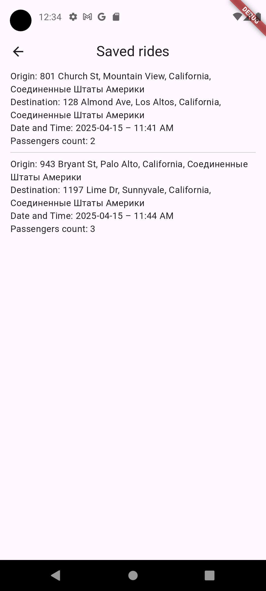

# 🚗 Ride Booking App

A simple ride booking app built in **Flutter** using **BLoC**, **Google Maps**, and location services. This app demonstrates core functionalities like selecting origin/destination, choosing passenger count, booking rides, and viewing past bookings.

## 📸 Demo

| Home Screen | Select Origin/Destination | BottomSheet | View Booked Rides |
|-------------|---------------------------|--------------------|--------------------|
|  |  |  |  |

🎥 [Watch video demo here]([https://your-video-link-here.com](https://youtube.com/shorts/kFhhS0xiZvE))  

## 🧠 Architecture

This app follows a **feature-first architecture** with clean separation of concerns across three layers:
- **Domain Layer** – business logic, use cases, and entities
- **Data Layer** – repositories and data sources
- **Presentation Layer** – UI, BLoC, and widgets

## 🔧 Features

- 🌍 Select origin and destination using Google Maps  
- 📍 Current location integration  
- 👥 Set number of passengers  
- 📅 Choose ride date & time  
- 📚 View list of previously booked rides  
- ✨ Responsive and user-friendly UI  
- 🧱 BLoC state management

## 📦 Dependencies

- flutter_bloc	=> BLoC state management
- google_maps_flutter	=> Google Maps integration
- geolocator	=> Device location services
- geocoding	=> Convert coordinates to readable addresses

## 🛠️ Setup Instructions

- You will need an Android emulator or real Android based phone
- Clone repository 
- Firstly, insert into ***lib/src/di/modules/constants_module.dart*** your GoogleMapsApi key to make googleMapsWork
- run flutter pub get
- run flutter run
